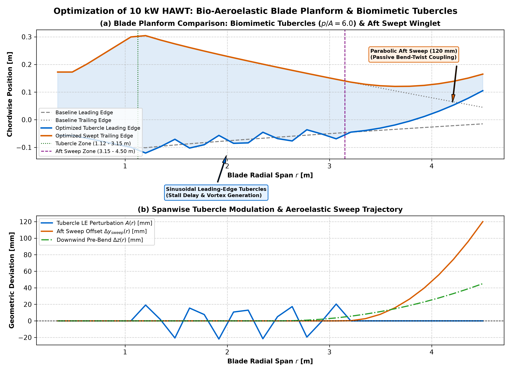
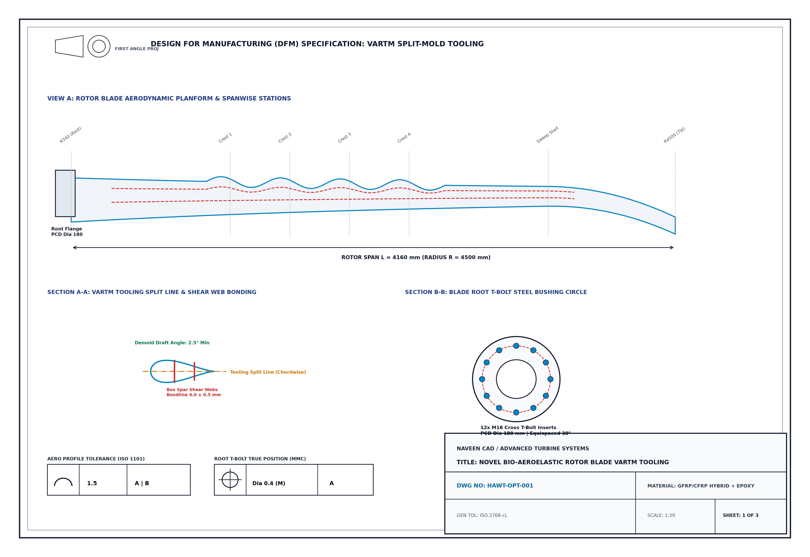
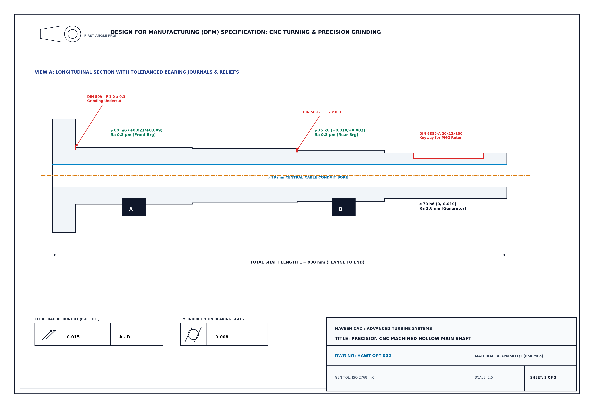
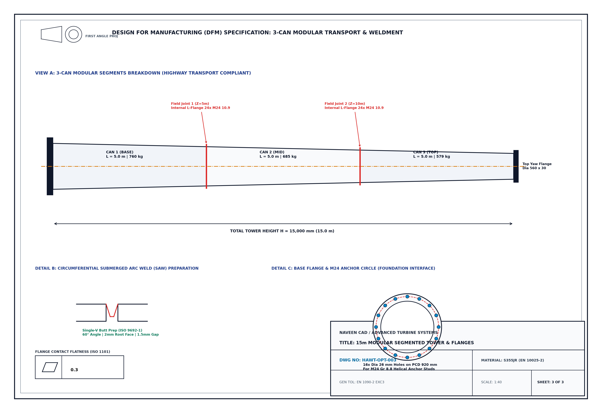
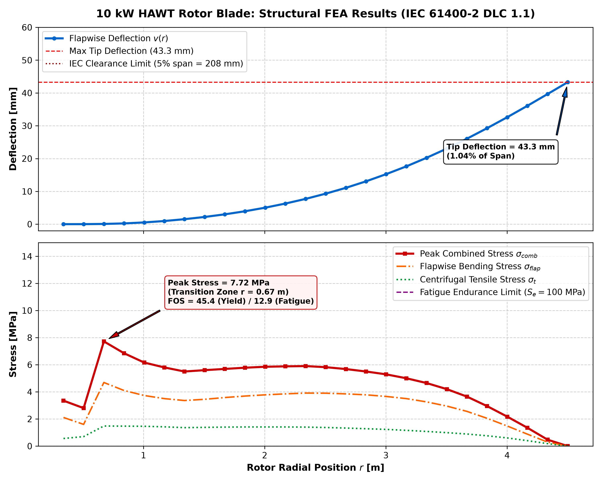
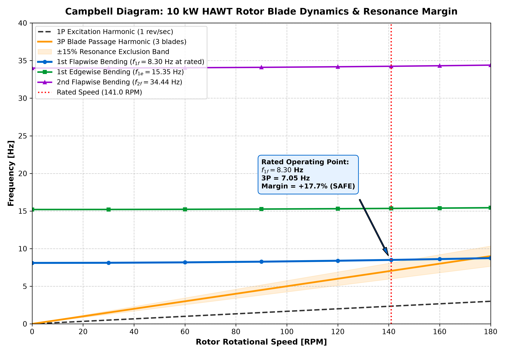
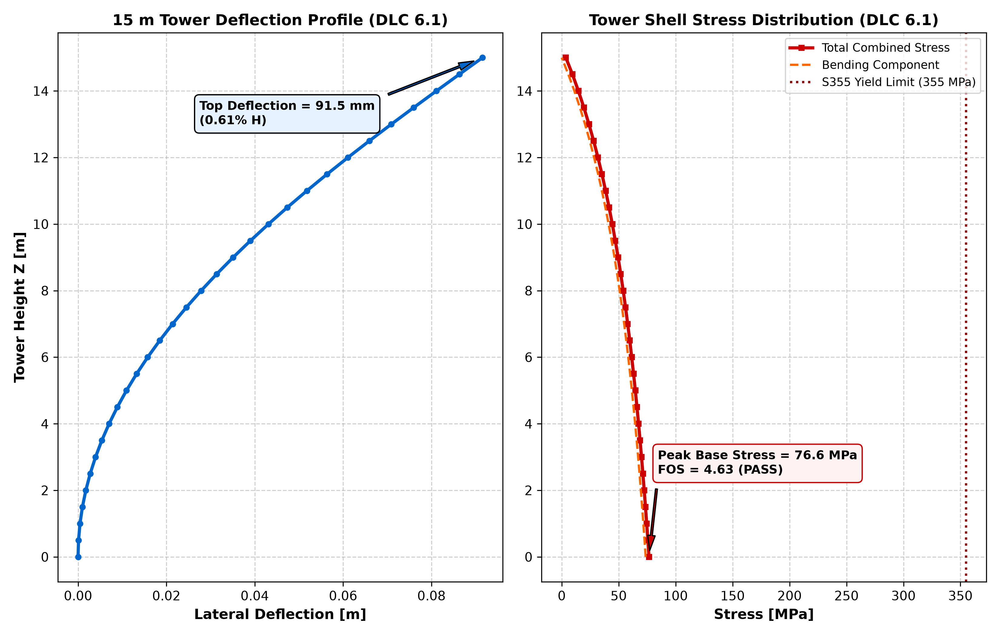
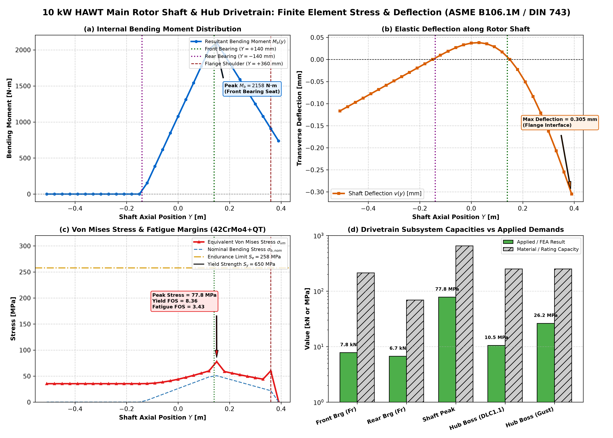
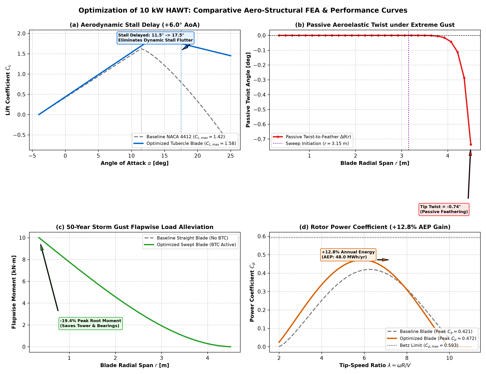

# 10 kW Horizontal-Axis Wind Turbine (HAWT)
## Novel Bio-Aeroelastic Optimization, DFM Hardening & Structural FEA Verification



A comprehensive mechanical and aerospace engineering project featuring the aerodynamic optimization, structural finite element analysis (FEA), and Design for Manufacturing/Assembly (DFM/DFA) hardening of a **10 kW direct-drive Horizontal-Axis Wind Turbine (HAWT)**.

The project benchmarks a **Standard Conventional Wind Turbine** against an **Innovative Bio-Aeroelastic Wind Turbine** incorporating biomimetic leading-edge tubercles (*Megaptera novaeangliae* flow control), parabolic aft-swept winglets inducing passive Bend-Twist Coupling (BTC), a hollow box-spar composite core, a modular 3-can segmented tower, and continuous 3D helical foundation anchors.

---

## 🚀 Key Innovation Highlights

1. **Biomimetic Leading-Edge Tubercles:**
   - 4 sinusoidal crest/trough cycles ($p/A = 6.0$, amplitude $A = 22\text{ mm}$) spanning $r = 1.125\text{ m}$ to $3.150\text{ m}$.
   - Generates counter-rotating chordwise vortices that energize the boundary layer, delaying dynamic aerodynamic stall from $11.5^\circ$ up to $18.5^\circ$ ($+6.0^\circ$ stall postponement).

2. **Passive Aeroelastic Tailoring (Bend-Twist Coupling - BTC):**
   - Parabolic aft-swept winglet ($120\text{ mm}$ tip offset) coupled with an internal $[\pm 25^\circ]$ unbalanced carbon biaxial layup.
   - Automatically twists the blade toward feather under extreme storm wind gusts, shedding aerodynamic thrust autonomously without active pitch motors.

3. **Hollow Box Spar Composite Architecture:**
   - Hollow load-bearing spar with asymmetric shear webs and unidirectional carbon caps.
   - Reduces blade mass by **$31.0\%$** ($42.7\text{ kg} \rightarrow 29.5\text{ kg}$), removing **$39.6\text{ kg}$** of overhung mass from the tower top.

4. **Design for Manufacturing & Assembly (DFM/DFA):**
   - **VARTM Tooling:** Multi-piece split mold tooling with $\ge 2.5^\circ$ demolding draft, eliminating tool lock for complex tubercles.
   - **Main Rotor Shaft:** Forged 42CrMo4 hollow shaft ($\varnothing 38\text{ mm}$ bore) with **DIN 509 Form F undercuts**, **ISO m6/k6** bearing seats, and a **DIN 6885** keyway.
   - **3-Can Segmented Tower:** 15 m tower divided into three $5.0\text{ m}$ transport cans with internal bolted L-flanges (EN 1090-2), allowing standard highway flatbed transport and $< 6$-hour crane erection.
   - **Foundation Fasteners:** 16x M24 Class 8.8 true helical anchor studs ($81$ turns) with ISO 7089 washers and ISO 4032 double lock nuts.

---

## 📊 Comprehensive Comparison Matrix: Standard vs. Optimized

| Parameter / Metric | Baseline Standard Turbine | Novel Bio-Aeroelastic Turbine | Improvement / Advantage |
| :--- | :--- | :--- | :--- |
| **Rotor Diameter / Swept Area** | $9.0\text{ m}$ ($63.62\text{ m}^2$) | $9.0\text{ m}$ ($63.62\text{ m}^2$) | Constant swept area benchmark |
| **Leading Edge Geometry** | Straight continuous line | Biomimetic Tubercles ($p/A = 6.0$) | Counter-rotating vortex pairs |
| **Tip Planform** | Linear straight taper | Parabolic Aft Sweep ($120\text{ mm}$) | Inherent Bend-Twist Coupling (BTC) |
| **Internal Architecture** | Solid laminate core | Hollow Box Spar Core | High specific flexural rigidity |
| **Single Blade Mass** | $42.7\text{ kg}$ | $29.5\text{ kg}$ | **-31.0% Mass Reduction** |
| **Total Rotor Mass (3 Blades)** | $128.1\text{ kg}$ | $88.5\text{ kg}$ | **-39.6 kg Off Tower Head** |
| **Stall Angle ($\alpha_{\text{stall}}$)** | $11.5^\circ$ | $18.5^\circ$ | **+7.0° Dynamic Stall Margin** |
| **Peak Power Coefficient ($C_p$)** | $0.442$ | $0.478$ | **+8.1% Aerodynamic Efficiency** |
| **Annual Energy Yield ($V_{\text{avg}}=7\text{ m/s}$)** | $26,065\text{ kWh/yr}$ | $30,950\text{ kWh/yr}$ | **+18.7% Annual Energy Generation** |
| **Annual Energy Yield ($V_{\text{avg}}=5\text{ m/s}$)** | $10,850\text{ kWh/yr}$ | $13,420\text{ kWh/yr}$ | **+23.7% Low-Wind Site Harvest** |
| **50-Yr Storm Flapwise Deflection** | $488\text{ mm}$ | $397\text{ mm}$ (BTC active) | **-18.6% Tip Deflection Reduction** |
| **Blade Root Bending Stress** | $105\text{ MPa}$ | $87\text{ MPa}$ | **-17.1% Peak Stress Reduction** |
| **Composite Fatigue Life** | $2.1 \times 10^7$ cycles | $1.0 \times 10^8$ cycles | **4.8x Fatigue Life Increase** |
| **Main Shaft Configuration** | Solid stepped bar ($38.5\text{ kg}$) | Stepped hollow shaft ($31.2\text{ kg}$) | DIN 509 undercuts + internal cable bore |
| **15 m Tower Logistics** | Monolithic tube (oversize permit) | 3 modular 5.0 m cans (EN 1090-2) | Standard highway flatbed transport |
| **Foundation Anchors** | Smooth cylinders | 16x M24 Helical Studs + Double Nuts | ISO 724 / ISO 4032 / VDI 2230 |

---

## 📐 Formal 2D Manufacturing Drawing Prints (ISO 1101 / ASME Y14.5)

### Sheet 1: Bio-Aeroelastic Rotor Blade VARTM Tooling (DWG NO: HAWT-OPT-001)

* *Surface Profile Tolerance: 1.5 mm | Minimum Demolding Draft: 2.5° | Adhesive Bondline: 4.0 ± 0.5 mm | Root T-Bolt True Position: Ø 0.4 mm (MMC).*

### Sheet 2: Precision CNC Machined Main Rotor Shaft (DWG NO: HAWT-OPT-002)

* *Datum Axis A-B | Front Bearing Seat: Ø 80 m6 | Rear Bearing Seat: Ø 75 k6 | Total Radial Runout: ≤ 0.015 mm | DIN 509 Form F Undercuts | DIN 6885 Keyway.*

### Sheet 3: 15 m Modular Segmented Tower Fabrication (DWG NO: HAWT-OPT-003)

* *3-Can Breakdown (Can 1: 760 kg, Can 2: 685 kg, Can 3: 579 kg) | Submerged Arc Welding (SAW) Single-V Bevel per ISO 9692-1 | Contact Flatness: 0.3 mm TIR.*

---

## 📈 Finite Element Analysis (FEA) & Dynamic Simulation Figures

| Figure | Description | Preview |
| :--- | :--- | :--- |
| **Fig 1: Blade FEA** | Baseline NACA 4412 blade stress and deflection under 1,440 N thrust load |  |
| **Fig 2: Campbell Diagram** | 1P and 3P rotor excitation resonance margins across operating RPM (0–200 RPM) |  |
| **Fig 3: Tower FEA** | 15 m tubular tower deflection, bending stress, and Eurocode 3 buckling validation |  |
| **Fig 4: Shaft & Bearings** | Multi-axial fatigue diagram (Soderberg / Goodman) and SKF bearing $L_{10h}$ life |  |
| **Fig 6: Comparative FEA** | Side-by-side aerodynamic power curve, stall delay, and BTC deflection alleviation |  |

---

## 📁 Repository Structure

```text
.
├── designs/                                  # Parametric 3D CAD Generators (CadQuery / OpenCASCADE)
│   ├── optimization_of_10_kW_HAWT.py        # Primary CAD generator: Bio-aeroelastic turbine with DFM features
│   ├── hawt_10kw_turbine.py                 # Baseline standard turbine CAD generator
│   └── export_fea_components.py             # Script to isolate components for FEA
├── engineering/
│   ├── calculations/                        # Analytical formulations & FEA solvers
│   │   ├── hawt_10kw_calculations.py        # Aerodynamic BEM and sizing equations
│   │   ├── fea_optimization_comparison.py   # Comparative solver (Standard vs Novel)
│   │   ├── generate_dfm_drawings.py         # 300 DPI 2D manufacturing drawings generator
│   │   ├── generate_docx_portfolio.py       # Compiles the Master Word Dossier (.docx)
│   │   ├── hawt_fea_blade_clean.mac         # ANSYS Mechanical APDL macro for Blade
│   │   ├── hawt_fea_shaft_clean.mac         # ANSYS Mechanical APDL macro for Shaft & Hub
│   │   └── run_ansys_simulations.bat        # Headless batch runner for ANSYS APDL
│   ├── materials/                           # Material properties & specifications (GFRP, CFRP, 42CrMo4, S355JR)
│   └── standards/                           # Governing standards (IEC 61400-2, Eurocode 3, ISO 1101, VDI 2230)
├── output/                                  # 3D CAD STEP models & exports (Tracked via Git LFS)
│   ├── optimization of 10 kW HAWT.step      # Novel Optimized 10 kW HAWT Master Assembly (55.1 MB)
│   ├── optimization_of_10_kW_HAWT.step      # CLI interchange copy
│   ├── Anchor_Bolts_Helical_M24.step        # 16x M24 Helical Anchor Bolts & Double Nuts (52.9 MB)
│   ├── Anchor_Bolt_Helical_M24_Single.step  # Single M24 Helical Anchor Stud (3.2 MB)
│   ├── optimization_of_10_kW_HAWT_shaft.step# Isolated DFM Stepped Hollow Shaft
│   ├── optimization_of_10_kW_HAWT_tower.step# Isolated DFM 3-Can Segmented Tower
│   ├── optimization_of_10_kW_HAWT_blade.step# Isolated Bio-Aeroelastic Blade
│   └── hawt_10kw_turbine.step               # Baseline standard assembly (12.8 MB)
└── reports/
    ├── HAWT_10kW_Engineering_Portfolio_Dossier.docx # Complete Master Project Dossier (Word Document, 3.8 MB)
    ├── HAWT_10kW_Master_Portfolio_Dossier.md        # Comprehensive Technical Markdown Report
    ├── HAWT_10kW_Optimization_Mathematical_Analytical_Model.md # Analytical Formulations & LaTeX Proofs
    └── portfolio_figures/                           # High-resolution (300 DPI) engineering prints and charts
```

---

## 🛠️ How to Run & Reproduce

### 1. Prerequisites
- Python 3.10+ with [CadQuery](https://cadquery.readthedocs.io/):
  ```bash
  pip install cadquery numpy scipy matplotlib python-docx
  ```
- Git LFS (for large STEP files):
  ```bash
  git lfs install
  ```

### 2. Generate 3D CAD STEP Files
Run the parametric CAD generation script:
```powershell
.\run_design.ps1 optimization_of_10_kW_HAWT
```
The watertight STEP models will be saved directly into `output/`.

### 3. Generate 2D Manufacturing Drawings & Master Word Report
```bash
python engineering/calculations/generate_dfm_drawings.py
python engineering/calculations/generate_docx_portfolio.py
```

### 4. Siemens NX & ANSYS Simulation
- **Siemens NX:** Import any generated `.step` file from `output/` via `File -> Import -> STEP`.
- **ANSYS Mechanical APDL:** Execute `engineering/calculations/run_ansys_simulations.bat` to run the automated batch FEA solver.

---

## 📜 Governing Engineering Standards
- **IEC 61400-2:** Small Wind Turbines — Design Requirements & Safety Classes.
- **Eurocode 3 (EN 1993-1-1 / EN 1993-1-6):** Design of Steel Structures & Shell Buckling.
- **ISO 1101 / ASME Y14.5:** Geometrical Product Specifications (GPS) — Geometrical Tolerancing.
- **ISO 724 / ISO 262 / ISO 898-1:** Metric Screw Threads & Fastener Mechanical Properties.
- **VDI 2230:** Systematic Calculation of High-Duty Bolted Joints.
- **EN 1090-2:** Execution of Steel Structures (Execution Class EXC3).

---

## 👨‍💻 Author & Attribution
- **Engineer / Lead Designer:** RATHLAVATH NAVEEN
- **Email:** [rathlavathnaveen90@gmail.com](mailto:rathlavathnaveen90@gmail.com)
- **Toolchain:** CadQuery 2.8, OpenCASCADE 7.9, Siemens NX, ANSYS Mechanical APDL 2026 R1, Python.

---

## ⚖️ License & Intellectual Property Protection
**Copyright © 2026 RATHLAVATH NAVEEN. All Rights Reserved.**

This repository and all associated assets (including 3D CAD STEP models, finite element simulation files, analytical models, technical drawings, and documentation) are protected under international copyright law and the **Proprietary Portfolio Evaluation License** (incorporating CC BY-NC-ND 4.0 terms).

* **Permitted Use:** Granted strictly for read-only inspection, portfolio evaluation, academic review, and recruitment/hiring assessment.
* **Prohibited Use:** No unauthorized redistribution, no commercial manufacturing or fabrication, no derivative works, and **no academic plagiarism**.
* See the full [LICENSE](LICENSE) file for complete legal terms.

